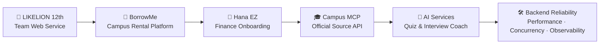

 

  

  

<strong>사용자의 흩어진 문제를 서비스 흐름으로 정리하고, 백엔드와 AI로 동작하게 만듭니다.</strong>

  

---

## 👋 Profile Snapshot

<table>
<tr>
<td width="33%" align="center">
<strong>Product Thinking</strong> 
문제 정의 · 사용자 여정 
서비스 시나리오 · 발표용 프로토타입
</td>
<td width="33%" align="center">
<strong>Backend</strong> 
Spring Boot · REST API 
Auth · Reservation · File Upload
</td>
<td width="33%" align="center">
<strong>Reliability</strong> 
Concurrency · Cache 
Fallback · Observability
</td>
</tr>
</table>

<table>
<tr>
<td width="50%" valign="top">

<h3>Now</h3>
<ul>
  <li>하나 청년 금융인재 양성 프로젝트 본선 합격 및 활동</li>
  <li>멋쟁이사자처럼 12기 @ 가톨릭대학교 활동</li>
  <li>캠퍼스, 금융, 학습, 면접 준비처럼 실제 사용자 맥락이 있는 문제에 관심</li>
</ul>

</td>
<td width="50%" valign="top">

<h3>Built With</h3>
<ul>
  <li>Spring Boot, JPA, JWT, Redis, Docker</li>
  <li>Claude API, RAG, MCP, SSE streaming</li>
  <li>k6, query optimization, pessimistic lock</li>
</ul>

</td>
</tr>
</table>

---

## ✨ Featured Work

<table>
<tr>
<td width="50%" valign="top">

<h3>🏦 Hana EZ</h3>

<strong>외국인 유학생 금융 온보딩 체크리스트형 프로토타입</strong>

<ul>
  <li>학교·비자·국적·ARC 상태 기반 온보딩 흐름</li>
  <li>지금 가능한 일, 다음 단계, 잠김 항목 분리</li>
  <li>금융 조건을 발표 가능한 서비스 플로우로 재구성</li>
</ul>

<a href="https://github.com/jinhyuk9714/Student_Start_Mode_demo">Repository →</a>

</td>
<td width="50%" valign="top">

<h3>🎓 songsim-campus-mcp</h3>

<strong>공식 source 기반 Remote MCP + HTTP API 서버</strong>

<ul>
  <li>공지, 학사일정, 강의, 도서관, 식당, Wi-Fi 정보 통합</li>
  <li>공식 source에 없는 값은 만들지 않는 신뢰 경계 설계</li>
  <li>QA corpus와 검증 기록 기반 답변 품질 관리</li>
</ul>

<a href="https://github.com/jinhyuk9714/songsim-campus-mcp">Repository →</a>

</td>
</tr>
<tr>
<td width="50%" valign="top">

<h3>🎒 BorrowMe</h3>

<strong>대학생 간 물건 대여를 위한 예약·검색·소셜 API</strong>

<ul>
  <li>예약, 알림, 검색, 랭킹, 이메일 인증 API</li>
  <li>재고 초과 예약 방지를 위한 동시성 제어</li>
  <li>상품 목록 조회 p95 1,010ms → 23ms 개선</li>
</ul>

<a href="https://github.com/jinhyuk9714/borrow_me">Repository →</a>

</td>
<td width="50%" valign="top">

<h3>🧠 AI Interview Coach</h3>

<strong>JD 분석 기반 질문 생성과 SSE 피드백을 제공하는 AI 면접 연습 서비스</strong>

<ul>
  <li>JD 분석, 질문 생성, 모의 면접, 피드백, 통계 흐름</li>
  <li>Spring Boot 5개 서비스와 Next.js 프론트엔드 구성</li>
  <li>Redis 캐싱, RAG, SSE 스트리밍 기반 피드백 경험</li>
</ul>

<a href="https://github.com/jinhyuk9714/interview-coach">Repository →</a>

</td>
</tr>
</table>

---

## 🗂 More Projects

<table>
<tr>
<td width="50%" valign="top">

<h3>🦁 Memory of Year</h3>

앨범·편지·사진·스티커 기반 추억 기록 서비스 
JWT 인증, S3 업로드, N+1 개선 31회 → 1회

<a href="https://github.com/jinhyuk9714/memory_of_year">Repository →</a>

</td>
<td width="50%" valign="top">

<h3>📚 Note2Quiz</h3>

강의자료를 AI 퀴즈, 오답노트, 복습 일정으로 연결하는 학습 루프 서비스 
의미 기반 채점, SM-2 복습 일정, Next.js

<a href="https://github.com/jinhyuk9714/Note2Quiz">Repository →</a>

</td>
</tr>
</table>

---

## 🛠 Tech Stack

  

---

## 🧭 Experience Flow

---

## 📊 GitHub & Algorithm

  

---

