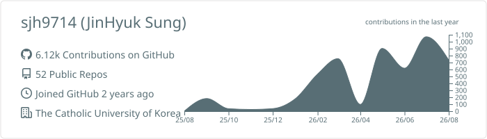
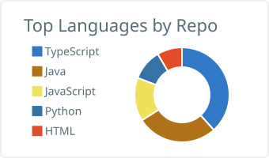
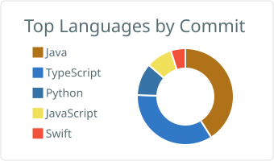

# 성진혁

**Java·Spring 백엔드** · **AI 에이전트 도구**
가톨릭대학교 컴퓨터공학 3학년

   

 

## 기술 스택

주력은 **Java · Spring** 이고, 도구를 만들 때는 **TypeScript** 를 씁니다.

 

## 활동과 팀 프로젝트

| 기간 | 활동 | 맡은 일 | 리포 |
|---|---|---|---|
| 2026.07~08 | 하나금융그룹 x 금융감독원 **청년 금융인재** (결선) | 백엔드 단독 구현 | [finmate-app](https://github.com/gaga-studio/finmate-app) |
| 2026.07~08 | 하나금융그룹 x SK텔레콤 **Tech4Good 해커톤** (7인) | 백엔드 | [eta](https://github.com/tech4good-2026/eta) |
| 2026.04~05 | 하나 청년 금융인재 **예선 통과작** | 기획 · 프로토타입 | [Student_Start_Mode_demo](https://github.com/sjh9714/Student_Start_Mode_demo) |
| 2024.12 | **멋쟁이사자처럼 12기** 데모데이 (7인) | 인증 · 앨범 · 편지 API, AWS 배포 | [memory_of_year](https://github.com/sjh9714/memory_of_year) |
| 2024.07~08 | **멋쟁이사자처럼 12기** 중앙해커톤 (6인) | 게시글 · 댓글 · JWT 인증 API | [likelion-backend](https://github.com/sjh9714/likelion-backend) |
| 2024.07 | **GGUM 해커톤** (11인, 2일) | 알림 기능 | [borrow_me](https://github.com/sjh9714/borrow_me) |

<a href="https://github.com/gaga-studio/finmate-app"><b>FinMate</b></a> — 20대의 첫 금융 온보딩 서비스. 3개월 쓰던 주제를 버리고 5일 만에 다시 만들었습니다. [회고](https://sjh9714.tistory.com/2)
<a href="https://github.com/tech4good-2026/eta"><b>My ETA</b></a> — 교통약자를 위한 개인화 배리어프리 길찾기. [회고](https://sjh9714.tistory.com/1)

Java·Spring 으로 동시성과 정합성을 다뤄본 기록은 [backend-portfolio](https://github.com/sjh9714/backend-portfolio) 에 정리해 뒀습니다.

 

## 만든 도구

AI 에이전트가 한 말과 실제로 한 일 사이의 간격을 좁히는 것들입니다. 전부 혼자 만들었습니다.

| 도구 | 하는 일 | |
|---|---|---|
| [**mergewarden**](https://github.com/sjh9714/mergewarden) | 에이전트 지시 파일(`AGENTS.md`, `CLAUDE.md`, `.mcp.json`)을 몰래 고치는 PR 을 잡습니다 |  |
| [**nuhuh**](https://github.com/sjh9714/nuhuh) | 에이전트가 완료했다고 하면 테스트와 빌드를 실제로 다시 돌려보고 영수증을 남깁니다 |  |
| [**red-handed**](https://github.com/sjh9714/red-handed) | 세션 로그와 git 을 대조해 에이전트가 말한 것과 한 것을 감사합니다 |  |
| [**rubric**](https://github.com/sjh9714/rubric) | 반복되는 PR 피드백을 사람·에이전트·CI 가 함께 쓰는 리포 규칙으로 바꿉니다 |  |

 

## 통계

<picture>
  <source media="(prefers-color-scheme: dark)" srcset="./profile-summary-card-output/github_dark/0-profile-details.svg">
  
</picture>

<picture>
  <source media="(prefers-color-scheme: dark)" srcset="./profile-summary-card-output/github_dark/1-repos-per-language.svg">
  
</picture>
<picture>
  <source media="(prefers-color-scheme: dark)" srcset="./profile-summary-card-output/github_dark/2-most-commit-language.svg">
  
</picture>

## 최근 글

<!-- BLOG-POST-LIST:START -->
- [내 클로드 코드 세팅](https://sjh9714.tistory.com/15)
- [코딩 장벽은 사라졌는데, 다른 벽이 보이기 시작했다 - 바이브 코딩 6개월](https://sjh9714.tistory.com/14)
- [AI 슬롭 - 품질이 아니라 신뢰가 문제다](https://sjh9714.tistory.com/13)
- [컴퓨터구조 다시 공부해보기](https://sjh9714.tistory.com/12)
- [요즘 자꾸 보이는 하네스, 루프, 그래프가 뭔지 공부해봤다](https://sjh9714.tistory.com/11)
<!-- BLOG-POST-LIST:END -->

통계 카드는 매일 06:00 KST 에 GitHub Action 이 다시 그려 이 리포에 커밋한다. 글 목록은 블로그 RSS 를 읽어 갱신한다. 남의 서버가 죽어도 안 깨진다.
