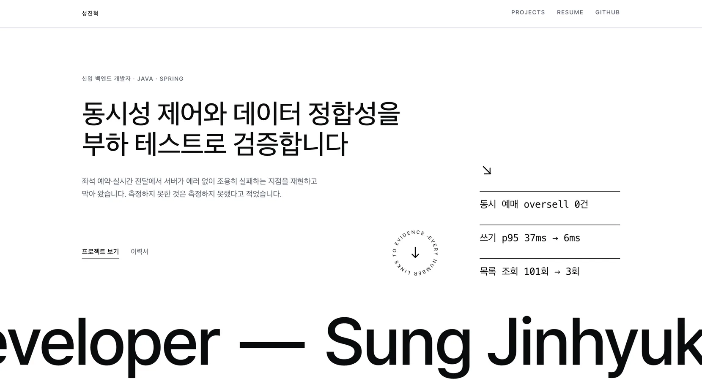
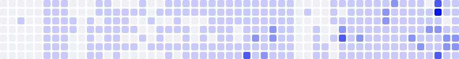

<picture>
  <source media="(prefers-color-scheme: dark)" srcset="assets/banner-dark.svg">
  
</picture>

**No one-line bio yet. I have receipts.**

I can't tell you what kind of developer I am — I haven't decided.
I get curious, build the thing, and keep the evidence: backend systems
load-tested until they stop lying, a cat that babysits AI coding agents,
a security lab you can prompt-inject, navigation for people the standard
walking speed lies to.

The pinned repos below are my current answer to "so, what do you do?"

한 줄 소개가 아직 없어서, 만든 것들로 대신합니다.

  <a href="https://sjh9714.vercel.app"><picture>
    <source media="(prefers-color-scheme: dark)" srcset="assets/pill-portfolio-dark.svg">
    
  </picture></a>&nbsp;
  <a href="https://sjh9714.tistory.com"><picture>
    <source media="(prefers-color-scheme: dark)" srcset="assets/pill-blog-dark.svg">
    
  </picture></a>&nbsp;
  <a href="mailto:jinhyuk9714@gmail.com"><picture>
    <source media="(prefers-color-scheme: dark)" srcset="assets/pill-email-dark.svg">
    
  </picture></a>

<picture>
  <source media="(prefers-color-scheme: dark)" srcset="assets/dashboard-dark.svg">
  
</picture>

<picture>
  <source media="(prefers-color-scheme: dark)" srcset="assets/graph-dark.svg">
  
</picture>
