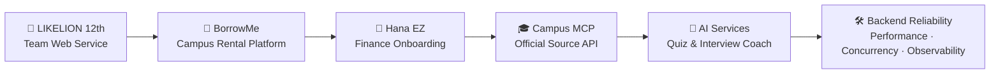

 

  

 

---

## 👋 About Me

사용자의 흩어진 문제를 서비스 흐름으로 정리하고,  
백엔드와 AI를 활용해 실제로 동작하는 결과물로 만드는 개발자입니다.

- 🏦 **2026 하나 청년 금융인재 양성 프로젝트** 본선 합격 및 활동
- 🦁 **2024 멋쟁이사자처럼 12기 가톨릭대학교** 활동
- 🎓 캠퍼스, 금융, 학습, 면접 준비처럼 실제 사용자 맥락이 있는 문제를 서비스로 풀어내는 데 관심이 있습니다.
- 🛠 Spring 기반 백엔드를 중심으로 인증, 예약, 파일 업로드, 동시성 제어, 성능 개선, AI 연동을 다뤄왔습니다.

---

## 🧭 Experience Map

---

## ✨ Featured Experiences

<table>
<tr>
<td width="50%" valign="top">

### 🏦 Hana EZ Student Start Mode

외국인 유학생의 입국 초기 금융 온보딩을 돕는  
**Hana EZ 기반 체크리스트형 프로토타입**입니다.

- 학교, 비자, 국적, ARC 상태 기반 온보딩 흐름
- 지금 가능한 일 / 다음 단계 / 잠김 항목 분리
- 발표용 정적 HTML 데모와 시연 흐름 제작

<a href="https://github.com/jinhyuk9714/Student_Start_Mode_demo">Repository →</a>

</td>
<td width="50%" valign="top">

### 🎓 songsim-campus-mcp

가톨릭대 성심교정 학생 정보를  
**공식 source 기반 Remote MCP + HTTP API**로 제공하는 서버입니다.

- 공지, 학사일정, 강의, 도서관, 식당, Wi-Fi 정보 통합
- 공식 source에 없는 값은 만들지 않는 신뢰 경계 설계
- QA corpus와 검증 기록 기반 답변 품질 관리

<a href="https://github.com/jinhyuk9714/songsim-campus-mcp">Repository →</a>

</td>
</tr>

<tr>
<td width="50%" valign="top">

### 🦁 Memory of Year

멋쟁이사자처럼 12기에서 진행한  
**앨범·편지·사진·스티커 기반 추억 기록 서비스**입니다.

- Spring Boot REST API, JWT 인증, S3 업로드
- 기획·디자인·프론트·백엔드 협업 프로젝트
- N+1 개선: DB 쿼리 31회 → 1회

<a href="https://github.com/jinhyuk9714/memory_of_year">Repository →</a>

</td>
<td width="50%" valign="top">

### 🎒 BorrowMe

대학생 간 물건 대여 흐름을 다루는  
**Spring Boot 예약·검색·소셜 API 프로젝트**입니다.

- 예약 시스템, 알림, 검색, 랭킹, 이메일 인증
- 재고 초과 예약 방지와 동시성 제어
- 상품 목록 조회 p95 1,010ms → 23ms 개선

<a href="https://github.com/jinhyuk9714/borrow_me">Repository →</a>

</td>
</tr>

<tr>
<td width="50%" valign="top">

### 📚 Note2Quiz

강의자료를 AI 퀴즈, 오답노트, 복습 일정으로 연결하는  
**학습 루프 서비스**입니다.

- PDF/텍스트 업로드 후 AI 퀴즈 생성
- 단답형·빈칸 문제 의미 기반 채점
- 오답노트와 SM-2 기반 복습 일정 제공

<a href="https://github.com/jinhyuk9714/Note2Quiz">Repository →</a>

</td>
<td width="50%" valign="top">

### 🧠 AI Interview Coach

JD 분석 기반 질문 생성과 SSE 피드백을 제공하는  
**AI 면접 연습 서비스**입니다.

- JD 분석, 질문 생성, 모의 면접, 피드백, 통계 흐름
- Spring Boot 5개 서비스와 Next.js 프론트엔드 구성
- Redis 캐싱, RAG, SSE 스트리밍, 성능 개선 기록

<a href="https://github.com/jinhyuk9714/interview-coach">Repository →</a>

</td>
</tr>
</table>

---

## 🛠 Tech Stack

### Main Tools

  

---

## 📌 Engineering Keywords

| Area | Keywords |
| --- | --- |
| 🧩 Product Thinking | 문제 정의, 사용자 여정, 서비스 시나리오, 발표용 프로토타입 |
| ⚙️ Backend | Spring Boot, REST API, JWT, JPA, 파일 업로드, 예약/주문 흐름 |
| 🚦 Reliability | 동시성 제어, Pessimistic Lock, Redis, fallback, 정합성 |
| 📈 Performance | N+1 개선, k6 부하 테스트, 캐시, 인덱스, 쿼리 최적화 |
| 🧠 AI Service | Claude API, RAG, MCP, SSE streaming, 프롬프트 파이프라인 |
| 🤝 Collaboration | 멋쟁이사자처럼, 해커톤, 4~11인 팀 프로젝트, 문서화 |

---

## 📊 GitHub Stats

---

## 🧮 Algorithm

---

