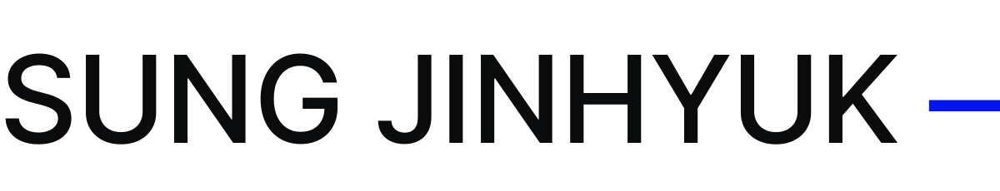
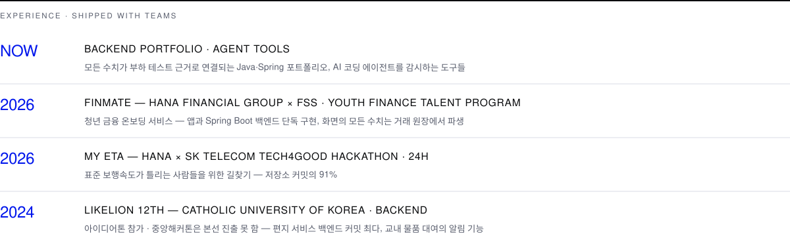

<picture>
  <source media="(prefers-color-scheme: dark)" srcset="assets/banner-dark.svg">
  
</picture>

**Sung Jinhyuk — a backend developer who learns by shipping with teams.**

팀에서 만들며 배워 온 신입 백엔드 개발자 성진혁입니다. The pinned repos are the receipts.

<picture>
  <source media="(prefers-color-scheme: dark)" srcset="assets/experience-dark.svg">
  
</picture>

<!-- 링크 안에 개행을 두면 그 공백이 밑줄 달린 텍스트 노드로 렌더된다 — 한 줄로 붙인다 -->

  <a href="https://sjh9714.vercel.app"><picture><source media="(prefers-color-scheme: dark)" srcset="assets/pill-portfolio-dark.svg"></picture></a>&nbsp;<a href="https://sjh9714.tistory.com"><picture><source media="(prefers-color-scheme: dark)" srcset="assets/pill-blog-dark.svg"></picture></a>&nbsp;<a href="mailto:jinhyuk9714@gmail.com"><picture><source media="(prefers-color-scheme: dark)" srcset="assets/pill-email-dark.svg"></picture></a>&nbsp;<a href="https://vluu.vercel.app"><picture><source media="(prefers-color-scheme: dark)" srcset="assets/pill-gallery-dark.svg"></picture></a>

<picture>
  <source media="(prefers-color-scheme: dark)" srcset="assets/dashboard-dark.svg">
  
</picture>

<picture>
  <source media="(prefers-color-scheme: dark)" srcset="assets/activity-dark.svg">
  
</picture>
