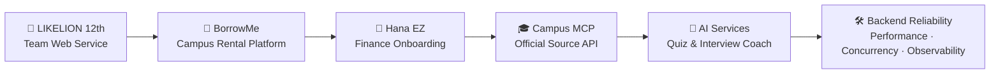

 

  

<strong>Product-minded Backend Developer</strong>

사용자의 흩어진 문제를 서비스 흐름으로 정리하고, 
Spring 백엔드와 AI를 활용해 실제로 동작하는 결과물로 만듭니다.

 

---

## 👋 About Me

사용자 맥락이 있는 문제를 서비스 시나리오로 정리하고, 인증·예약·파일 업로드·성능 개선·AI 연동까지 연결하는 백엔드 개발자입니다. 
Spring Boot 기반 REST API와 데이터 흐름 설계를 중심으로, 동시성 제어와 캐시, fallback 같은 신뢰성 요소에 관심이 많습니다. 
캠퍼스, 금융, 학습, 면접 준비처럼 실제 사용자가 겪는 불편을 작게 검증하고 제품 흐름으로 만드는 경험을 쌓고 있습니다.

## 🧩 Core Focus

| Area | What I Work On |
| --- | --- |
| Product Thinking | 문제 정의, 사용자 여정, 서비스 시나리오, 발표용 프로토타입 |
| Backend | Spring Boot, REST API, JWT, JPA, 파일 업로드, 예약·주문 흐름 |
| Reliability | 동시성 제어, Pessimistic Lock, Redis, fallback, 데이터 정합성 |
| Performance | N+1 개선, k6 부하 테스트, 캐시, 인덱스, 쿼리 최적화 |
| AI Service | Claude API, RAG, MCP, SSE streaming, 프롬프트 파이프라인 |

---

## ✨ Featured Experiences

### 🏦 Hana EZ · Student Start Mode Demo

외국인 유학생의 입국 초기 금융 온보딩을 돕는 Hana EZ 기반 체크리스트형 프로토타입입니다.

- 문제 맥락: 학교, 비자, 국적, ARC 상태에 따라 지금 가능한 금융 절차가 달라지는 흐름을 정리했습니다.
- 구현: 지금 가능한 일, 다음 단계, 잠김 항목을 분리한 정적 HTML 데모와 발표용 시연 흐름을 제작했습니다.
- 포인트: 금융 서비스의 복잡한 조건을 사용자가 이해할 수 있는 온보딩 플로우로 재구성했습니다.

[Repository →](https://github.com/jinhyuk9714/Student_Start_Mode_demo)

### 🎓 songsim-campus-mcp

가톨릭대 성심교정 학생 정보를 공식 source 기반 Remote MCP + HTTP API로 제공하는 서버입니다.

- 문제 맥락: 공지, 학사일정, 강의, 도서관, 식당, Wi-Fi 정보가 흩어져 있어 탐색 비용이 컸습니다.
- 구현: 공식 source를 기반으로 학생 정보 API를 구성하고, MCP 도구로 외부 AI 클라이언트와 연결했습니다.
- 포인트: 공식 source에 없는 값은 만들지 않는 신뢰 경계와 QA corpus 기반 검증 흐름을 설계했습니다.

[Repository →](https://github.com/jinhyuk9714/songsim-campus-mcp)

### 🎒 BorrowMe

대학생 간 물건 대여 흐름을 다루는 Spring Boot 예약·검색·소셜 API 프로젝트입니다.

- 문제 맥락: 대여 가능한 물건 탐색, 예약, 알림, 인증까지 이어지는 캠퍼스 거래 흐름이 필요했습니다.
- 구현: 예약 시스템, 알림, 검색, 랭킹, 이메일 인증 API를 구현했습니다.
- 포인트: Pessimistic Lock으로 재고 초과 예약을 방지하고, 상품 목록 조회 p95를 1,010ms에서 23ms로 개선했습니다.

[Repository →](https://github.com/jinhyuk9714/borrow_me)

### 🧠 AI Interview Coach

JD 분석 기반 질문 생성과 SSE 피드백을 제공하는 AI 면접 연습 서비스입니다.

- 문제 맥락: 지원자가 JD를 기반으로 질문을 준비하고, 답변 피드백과 통계를 이어서 확인할 수 있는 흐름이 필요했습니다.
- 구현: JD 분석, 질문 생성, 모의 면접, 피드백, 통계 흐름을 Spring Boot 5개 서비스와 Next.js 프론트엔드로 구성했습니다.
- 포인트: Redis 캐싱, RAG, SSE 스트리밍을 활용해 AI 피드백 경험과 응답 흐름을 개선했습니다.

[Repository →](https://github.com/jinhyuk9714/interview-coach)

---

## 🗂 More Projects

| Project | Summary | Stack / Point |
| --- | --- | --- |
| [Memory of Year](https://github.com/jinhyuk9714/memory_of_year) | 멋쟁이사자처럼 12기에서 진행한 앨범·편지·사진·스티커 기반 추억 기록 서비스 | Spring Boot REST API, JWT, S3 upload, N+1 개선 31회 → 1회 |
| [Note2Quiz](https://github.com/jinhyuk9714/Note2Quiz) | 강의자료를 AI 퀴즈, 오답노트, 복습 일정으로 연결하는 학습 루프 서비스 | Claude API, 의미 기반 채점, SM-2 복습 일정, Next.js |

---

## 🛠 Tech Stack

| Group | Tools & Topics |
| --- | --- |
| Backend | Java, Spring Boot, JPA/Hibernate, REST API, JWT, File Upload |
| Data / Infra | MySQL, PostgreSQL, Redis, Kafka, Docker, GitHub Actions |
| Reliability / Performance | Pessimistic Lock, Cache, Fallback, N+1 개선, k6, Prometheus, Grafana |
| AI / Data Flow | Claude API, RAG, MCP, SSE streaming, Prompt Pipeline |
| Frontend | Next.js, TypeScript, React, Tailwind CSS, Vercel |

---

## 🧭 Experience Map

---

## 📊 GitHub & Algorithm

  

---

